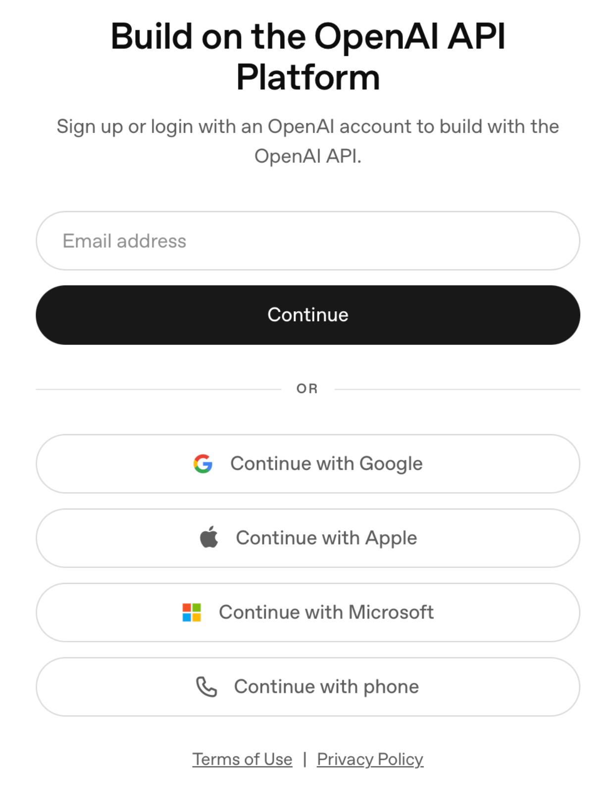
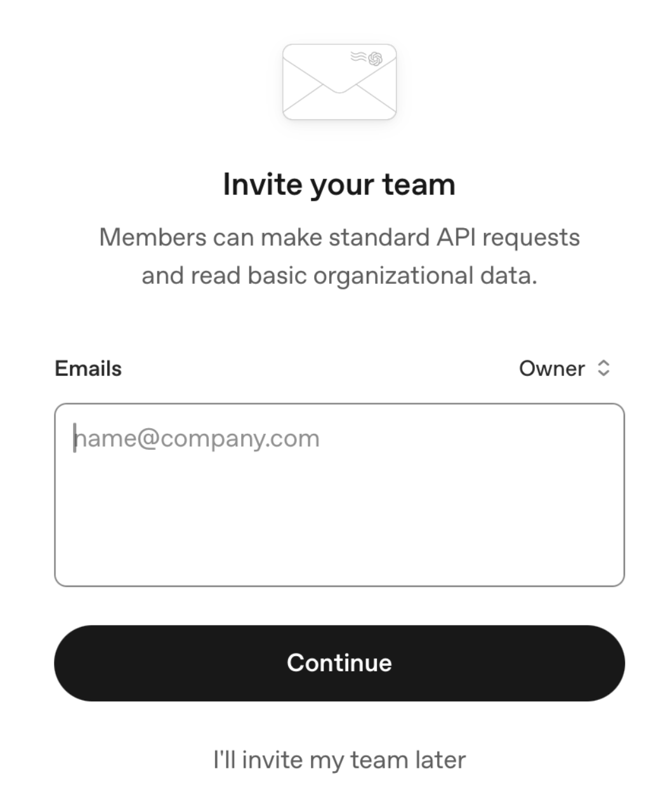
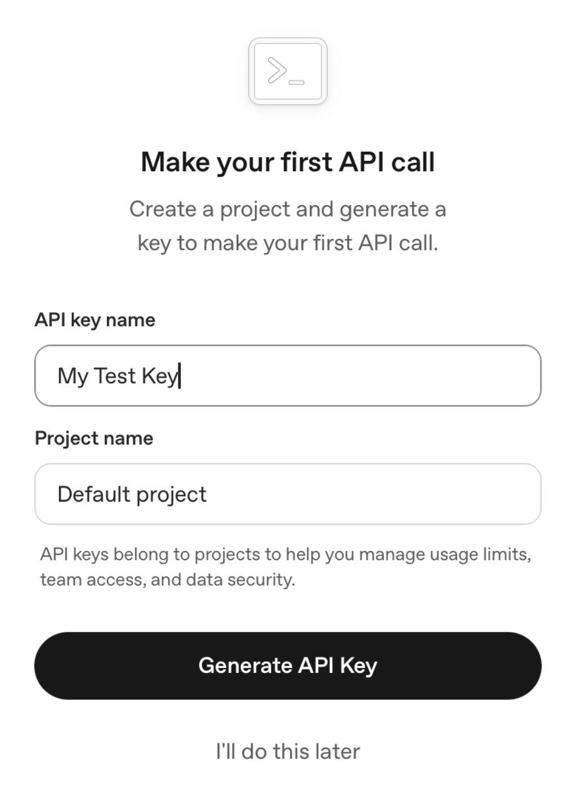
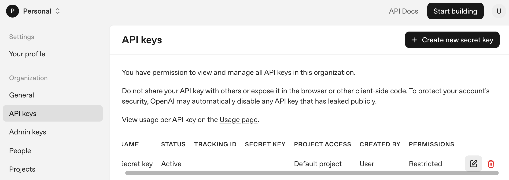
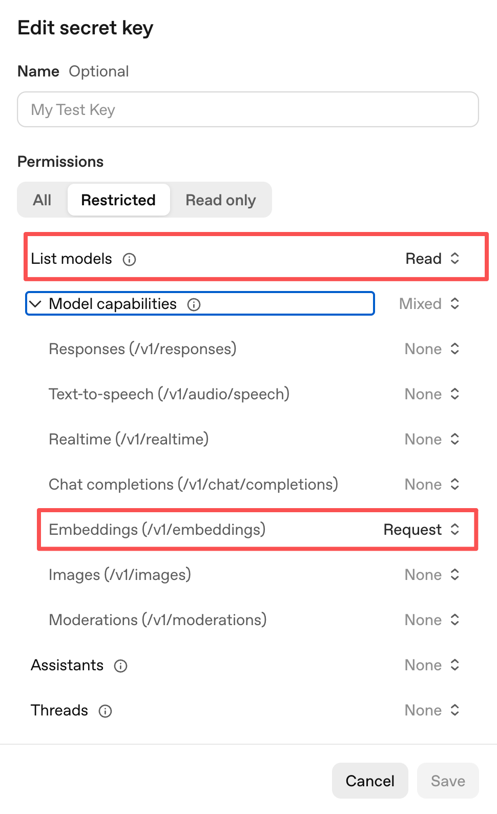
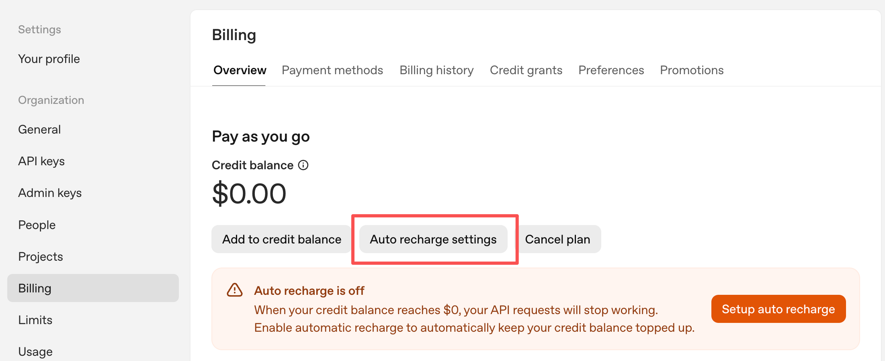
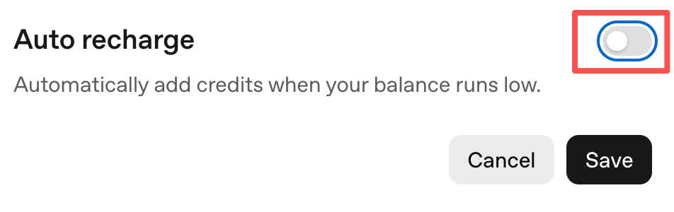
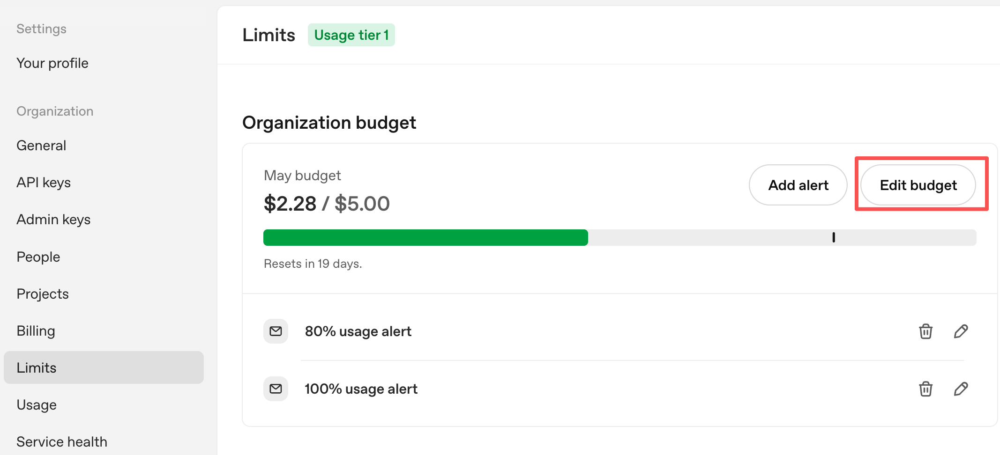

# OpenAI API Setup Guide

This app uses OpenAI's `text-embedding-3-large` model. You need an account, an API key, and a small prepaid credit balance (typically less than $5). Follow these steps before launching the app.

---

## Step 1 — Create an OpenAI account

Go to https://platform.openai.com and sign up.

Answer the onboarding questions as they apply to you.

---

## Step 2 — Skip the team invite

After signing up you'll be asked to invite team members.

Click **"I'll invite my team later"** at the bottom to skip.

---

## Step 3 — Generate your API key

You'll see the **"Make your first API call"** screen.

Give your key a name (e.g. `My Test Key`), leave the project as **Default project**, and click **Generate API Key**.

> The key is shown **only once** — copy it immediately and save it somewhere safe (password manager, private note). You will paste it into the app later.

---

## Step 4 — Set restrictions on your key

Go to https://platform.openai.com/settings/organization/api-keys (or click **API keys** in the left sidebar). You'll see the key you just created.

Click the edit (pencil) icon next to your key to open the **Edit secret key** panel.

Select **Restricted**, then set permissions as follows — everything **None** except:

- **List models** → `Read`
- **Embeddings (/v1/embeddings)** → `Request`

This limits the key to only what this app needs. If the key is ever leaked, it cannot be used for chat, images, or any other OpenAI service.

Click **Save**.

---

## Step 5 — Add credits and turn OFF auto-recharge

Go to **Billing** in the left sidebar. Click **Add to credit balance** if you haven't, and add a small testing amount.

Then click **Auto recharge settings**.

Make sure the **Auto recharge toggle is OFF**.

> **Why this matters:** With auto-recharge **OFF**, the app simply stops when your credits run out — you cannot accidentally overspend. With it **ON**, OpenAI will keep charging your card automatically. **Always keep it OFF.**
>
> Because of this, we recommend loading only the minimum credits you need and adding more manually when you are ready for a larger run.

---

## Step 6 — Set a budget and usage alerts

Go to **Limits** in the left sidebar. Click **Edit budget** to set a monthly spending cap, and **Add alert** to receive email notifications at 80% and 100% usage.

> **Note:** The budget here sends email alerts only — it will **not** hard-stop your spending if exceeded. The real hard stop is keeping **auto-recharge OFF** (Step 5). Monitor your usage regularly at https://platform.openai.com/settings/organization/usage

---

## Step 7 — Use the key in the app

Paste your `sk-...` key into the **OpenAI API Key** field in the Train or Predict tab. Click **Test** to confirm it works before starting a run.

Check **Save API key to config file** to store it locally so you don't have to re-enter it each session — only do this on your own personal computer and never share the **config.json** file (which will be saved to the project root folder) with others.
